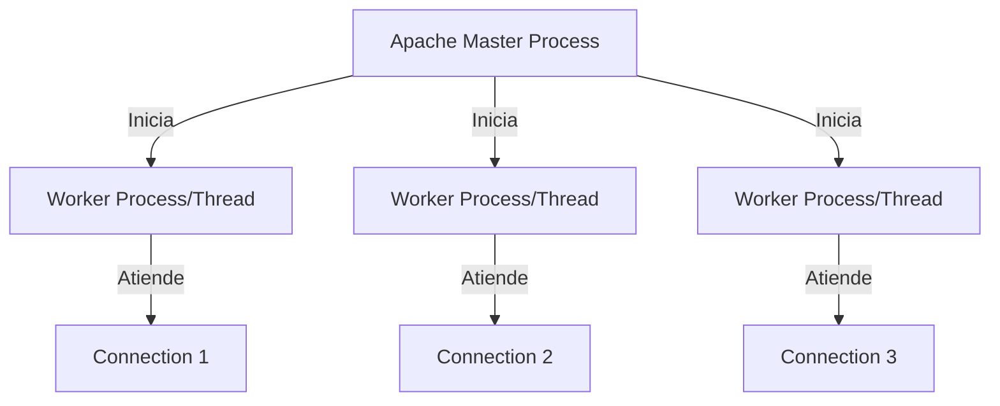
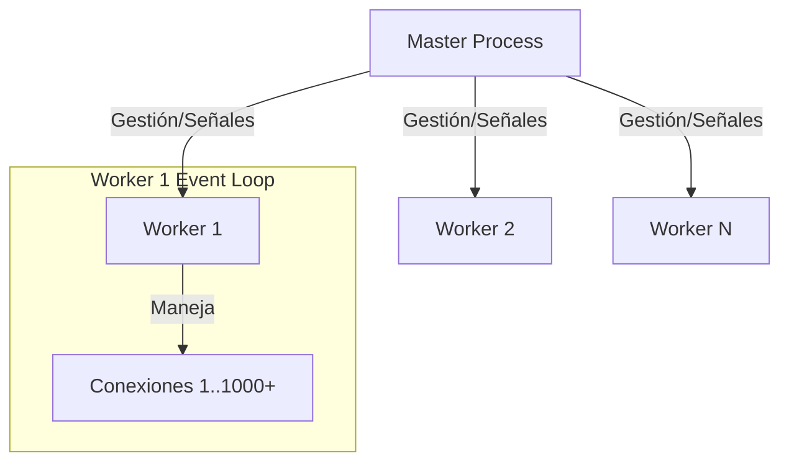
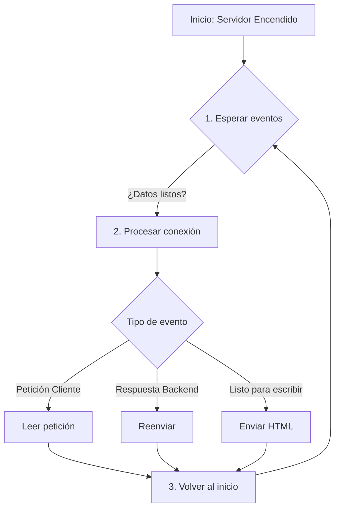

# Investigación Técnica: Despliegue de Servidores Web de Alto Rendimiento con Nginx y Docker

## Metadata de Investigación
- **Fecha**: 10 de febrero de 2026
- **Tema**: Implantación y Administración de Servidor Web con Docker
- **Enfoque**: Arquitectura interna, casos de uso reales, seguridad y alto rendimiento

---

## MÓDULO 1: FUNDAMENTOS DEL SERVICIO WEB

Antes de desplegar un servidor web o configurarlo, necesitamos entender **qué es**, **cómo se comunica con los clientes** y **por qué elegimos uno u otro**. Este módulo cubre los fundamentos: el protocolo HTTP, la evolución de sus versiones, el panorama actual de servidores web, y por qué Nginx se ha convertido en la opción dominante para sitios de alto tráfico.

---

### 1.1 ¿Qué es un Servidor Web?

Un **servidor web** tiene dos componentes:

- **Hardware**: La máquina física o virtual (CPU, RAM, disco, red) que aloja el servicio
- **Software (Daemon)**: El programa que escucha peticiones en los puertos 80 (HTTP) y 443 (HTTPS) y responde con páginas web, archivos o datos

Ejemplos de software servidor: **Nginx**, **Apache HTTP Server**, **IIS** (Microsoft), **LiteSpeed**.

#### Flujo básico: ¿Cómo funciona?

| # | Origen | Dirección | Destino | Acción | Detalle |
|:-:|:------:|:---------:|:-------:|:-------|:--------|
| **1** | 🧑‍💻 Navegador | ➡️ | 🖥️ Servidor | **Petición** | `GET /index.html` (Solicita recurso) |
| **2** | 🖥️ Servidor | ⚙️ | 🖥️ Servidor | **Proceso** | Busca archivo, ejecuta código, consulta BD |
| **3** | 🖥️ Servidor | ⬅️ | 🧑‍💻 Navegador | **Respuesta** | `HTTP 200 OK` + Archivo HTML |
| **4** | 🧑‍💻 Navegador | 👁️ | 🧑‍💻 Usuario | **Visualización** | Renderiza el HTML/CSS/JS |

**En resumen**: el navegador **pide** (petición HTTP), el servidor **busca** y **responde** (respuesta HTTP). Todo el protocolo HTTP que veremos a continuación define las reglas de esta conversación.

---

### 1.2 El Protocolo HTTP/S

#### Definición Técnica
HTTP (Hypertext Transfer Protocol) es un protocolo de capa de aplicación (Capa 7 OSI) basado en el modelo cliente-servidor que utiliza TCP como transporte.

#### Métodos HTTP Principales
- **GET**: Solicita un recurso (idempotente, cacheable)
- **POST**: Envía datos al servidor (no idempotente)
- **PUT**: Actualiza/crea un recurso (idempotente)
- **DELETE**: Elimina un recurso (idempotente)
- **HEAD**: Solicita headers sin body
- **OPTIONS**: Consulta métodos soportados
- **PATCH**: Modificación parcial

#### Códigos de Estado HTTP

**2xx - Éxito**
- `200 OK`: Petición exitosa
- `201 Created`: Recurso creado
- `204 No Content`: Éxito sin contenido de respuesta

**3xx - Redirección**
- `301 Moved Permanently`: Redirección permanente
- `302 Found`: Redirección temporal
- `304 Not Modified`: Recurso no modificado (caché válida)

**4xx - Error del Cliente**
- `400 Bad Request`: Sintaxis inválida
- `401 Unauthorized`: Autenticación requerida
- `403 Forbidden`: Sin permisos
- `404 Not Found`: Recurso no existe
- `429 Too Many Requests`: Rate limiting aplicado

**5xx - Error del Servidor**
- `500 Internal Server Error`: Error genérico del servidor
- `502 Bad Gateway`: Proxy recibió respuesta inválida del upstream
- `503 Service Unavailable`: Servidor temporalmente no disponible
- `504 Gateway Timeout`: Timeout del upstream

#### Cabeceras HTTP Críticas

**Cabeceras de Petición**:
```http
Host: ejemplo.com
User-Agent: Mozilla/5.0...
Accept: text/html,application/json
Accept-Encoding: gzip, deflate, br
Connection: keep-alive
Authorization: Bearer <token>
```

**Cabeceras de Respuesta**:

```http
Content-Type: application/json; charset=utf-8
Content-Length: 1234
Cache-Control: max-age=3600
Set-Cookie: session_id=abc123; Secure; HttpOnly
X-Frame-Options: DENY
```


---

### 1.3 Evolución del Protocolo HTTP

#### HTTP/1.1 (1997 - RFC 2616, actualizado RFC 7230-7235)

**Características**:

- **Keep-Alive (Persistent Connections)**: Reutilización de conexiones TCP
- **Pipelining**: Envío de múltiples peticiones sin esperar respuestas (poco usado por head-of-line blocking)
- **Chunked Transfer Encoding**: Permite transmisión sin conocer longitud total
- **Host Header**: Soporte para virtual hosts

**Limitaciones**:

- Una petición a la vez por conexión (sin multiplexación)
- Headers en texto plano (overhead)
- Head-of-Line Blocking en TCP

**Implementación Nginx**:

```nginx
http {
    keepalive_timeout 65;      # 65 segundos de Keep-Alive
    keepalive_requests 100;    # Máximo 100 peticiones por conexión
}
```


---

#### HTTP/2 (2015 - RFC 7540)

**Características Clave**:

1. **Multiplexación Binaria**:
    - Múltiples streams en una única conexión TCP
    - Frame-based protocol (binario, no texto)
    - Elimina head-of-line blocking a nivel de aplicación
2. **Compresión de Headers (HPACK)**:
    - Reduce overhead de headers repetitivos
    - Tabla de indexación dinámica
3. **Server Push**:
    - Servidor envía recursos proactivamente
    - Reduce latencia en recursos críticos
4. **Priorización de Streams**:
    - Dependencias y pesos para optimizar carga

**Limitaciones**:

- Sigue usando TCP: head-of-line blocking a nivel de transporte
- Si se pierde un paquete TCP, todos los streams se bloquean

**Configuración Nginx HTTP/2**:

```nginx
server {
    listen 443 ssl http2;
    ssl_certificate /etc/ssl/certs/cert.pem;
    ssl_certificate_key /etc/ssl/private/key.pem;
    
    # Server push
    http2_push /css/styles.css;
    http2_push /js/app.js;
}
```


---

#### HTTP/3 (2022 - RFC 9114) + QUIC

**Definición**: HTTP/3 es el mapeo de semántica HTTP sobre el protocolo de transporte QUIC (RFC 9000), que usa UDP en lugar de TCP.

**QUIC (Quick UDP Internet Connections)**:

- **Capa de transporte sobre UDP** (puerto 443)
- **TLS 1.3 integrado nativamente** en el transporte
- **Multiplexación sin head-of-line blocking**: pérdida de paquete afecta solo a un stream
- **Connection migration**: cambio de IP/red sin reiniciar conexión (identificadores de conexión)

**Ventajas HTTP/3**:

1. **Handshake más rápido**:
    - HTTP/2 sobre TCP+TLS: 2-3 RTT (Round Trip Time)
    - HTTP/3 sobre QUIC: 1 RTT (0-RTT para conexiones repetidas)
2. **Eliminación de head-of-line blocking**:
    - Pérdida de paquetes no bloquea otros streams
3. **Mejor rendimiento en redes móviles**:
    - Connection migration al cambiar de WiFi a 4G/5G

**Stack Comparison**:

| Capa | 🐢 HTTP/1.1 & HTTP/2 | 🚀 HTTP/3 (QUIC) |
|:----:|:--------------------:|:----------------:|
| **Aplicación** | HTTP/2 (Streams) | HTTP/3 (Streams) |
| **Seguridad** | TLS 1.2 / 1.3 (capa separada) | **TLS 1.3** (Integrado en QUIC) |
| **Transporte** | **TCP** (Fiable, lento por handshake) | **QUIC** (UDP + Fiabilidad por software) |
| **Red** | IP | IP |

> **Gran diferencia**: HTTP/3 elimina el handshake TCP redundante y el "head-of-line blocking" al mover la fiabilidad a QUIC (sobre UDP).

**Configuración Nginx HTTP/3 (Nginx 1.25+)**:

```nginx
server {
    listen 443 quic reuseport;          # QUIC/HTTP3
    listen 443 ssl http2;               # Fallback HTTP/2
    
    ssl_protocols TLSv1.3;              # TLS 1.3 obligatorio
    ssl_certificate /etc/ssl/cert.pem;
    ssl_certificate_key /etc/ssl/key.pem;
    
    # Anunciar HTTP/3 vía header Alt-Svc
    add_header Alt-Svc 'h3=":443"; ma=86400';
    
    quic_retry on;                      # Protección anti-DDoS
    ssl_early_data on;                  # 0-RTT resumption
}
```

> [!IMPORTANT]
> **Nota crítica para Docker**: HTTP/3 utiliza **UDP**, no TCP. Al dockerizar, es **obligatorio** mapear el puerto explícitamente como UDP o no funcionará:
> ```yaml
> ports:
>   - "443:443/tcp"   # HTTPS/2
>   - "443:443/udp"   # HTTP/3 (QUIC) ¡Vital!
> ```

**Adopción 2026**:

- Chrome, Firefox, Edge, Safari soportan HTTP/3
- ~40% del tráfico web global usa HTTP/3 (Cloudflare, Google, Facebook)

---

### 1.4 Mercado de Servidores Web (2025-2026)

#### Datos de Netcraft (Mayo 2025)

| Servidor | Mayo 2025 | % Market Share | Cambio |
| :-- | :-- | :-- | :-- |
| **Nginx** | 259,608,513 | **21.15%** | +0.37pp |
| **Apache** | 187,533,263 | **15.28%** | -0.15pp |
| **Cloudflare** | 197,436,000 | ~16% | +0.04pp |
| **LiteSpeed** | 57,000,000 | ~4.6% | Creciendo |

#### Sitios de Alto Tráfico (Top 1M)

| Servidor | Mayo 2025 | % Share |
| :-- | :-- | :-- |
| **Nginx** | 5,516,359 | 40.95% |
| **Apache** | 3,069,468 | 22.79% |

**Tendencias**:

- Nginx domina en sitios de **alto tráfico** (>1M visitas/mes)
- Apache mantiene presencia en hosting compartido y aplicaciones legacy
- Cloudflare Server (fork de Nginx) gana terreno en CDN
- LiteSpeed crece en hosting web por soporte nativo de HTTP/3 y Quic

**Por qué Nginx domina el alto tráfico**:

1. Arquitectura event-driven (mayor concurrencia)
2. Menor footprint de memoria (~2.5MB vs ~10MB Apache)
3. Proxy reverso más eficiente
4. Mejor rendimiento sirviendo contenido estático

---

### 1.5 Arquitectura Nginx: Modelo Event-Driven

#### Definición Técnica

Nginx utiliza una **arquitectura asíncrona, no-bloqueante, basada en eventos** (event-driven) en lugar del modelo tradicional de un proceso/thread por conexión.

#### Comparación: Apache vs Nginx


**Apache (MPM Prefork/Worker)**:



- **1 thread/proceso = 1 conexión**
- Consume ~3-5MB RAM por worker
- Context switching costoso con miles de conexiones

**Nginx (Event-Driven)**:



- **1 worker = miles de conexiones**
- Worker single-threaded, pinned a CPU
- Event loop con epoll/kqueue (Linux/BSD)


#### Funcionamiento del Event Loop

**Analogía**: Imagina un **recepcionista de hotel**:

- **Modelo Apache** (1 recepcionista por cliente): Cada huésped tiene su propio recepcionista asignado. Si un recepcionista espera a que alguien rellene un formulario, no puede atender a nadie más. Con 1.000 huéspedes, necesitas 1.000 recepcionistas → costoso.

- **Modelo Nginx** (1 recepcionista para todos): Un solo recepcionista atiende a muchos huéspedes. Mientras uno rellena el formulario, atiende a otro. Cuando el primero termina, vuelve a él. Con 1.000 huéspedes, 1 recepcionista eficiente es suficiente → rápido y económico.

Esto es exactamente lo que hace el **event loop** de Nginx: un worker atiende miles de conexiones alternando entre ellas según quién tenga datos listos para procesar.

**Ciclo del Event Loop (simplificado)**:



**Flujo de una petición HTTP**:

1. Leer petición
2. Procesar
3. Consultar backend (si es necesario)
4. Enviar respuesta
5. Mantener conexión o cerrar


#### Ventajas del Modelo Event-Driven

1. **Alta Concurrencia (C10k problem solved)**:
    - 10,000+ conexiones simultáneas con < 100MB RAM
    - Apache requiere GB de RAM para lo mismo
2. **Bajo consumo de CPU**:
    - Sin context switching entre threads
    - Worker pinned a CPU core
3. **Predecibilidad**:
    - Consumo de recursos lineal con el número de workers (no con conexiones)
4. **Eficiencia en I/O**:
    - No bloquea en operaciones lentas (disco, upstream)

#### Configuración Nginx Workers

```nginx
# Nginx.conf
worker_processes auto;  # 1 worker por CPU core
worker_cpu_affinity auto;  # Pin workers a CPU cores específicos

events {
    worker_connections 4096;  # Máx conexiones por worker
    use epoll;                # Event mechanism (Linux)
    multi_accept on;          # Acepta múltiples conexiones a la vez
}
```

**Cálculo de conexiones máximas**:

```
Max Connections = worker_processes × worker_connections
```

Ejemplo: 4 cores × 4096 conexiones = 16,384 conexiones simultáneas

---

### 1.6 Ventajas de Nginx

#### 1. Rendimiento (Performance)

**Benchmarks típicos**:

- **Contenido estático**: 50,000-100,000 req/s en hardware moderno
- **Proxy reverso**: 10,000-30,000 req/s dependiendo de backend
- **Latencia**: sub-milisegundo para recursos estáticos en caché

**Comparación con Apache**:

- Nginx: 2x-4x más rápido sirviendo estáticos
- Nginx: 3x-5x mayor throughput en proxy reverso


#### 2. Bajo Consumo de RAM (Memory Footprint)

**Footprint típico**:

- Master process: ~2-3 MB
- Worker process: ~2-5 MB base + (conexiones × ~1KB)
- Total típico: 50-200 MB para 10,000 conexiones

**Apache equivalente**: 500-1500 MB para la misma carga

#### 3. Escalabilidad Horizontal y Vertical

**Vertical**: Añadir más cores = añadir más workers (lineal)
**Horizontal**: Múltiples instancias detrás de load balancer

#### 4. Versatilidad

- Servidor web estático
- Proxy reverso (HTTP, WebSocket, gRPC)
- Load balancer (L7)
- Proxy de caché
- Terminación SSL/TLS


#### 5. Configuración Declarativa

Archivos de configuración legibles y modularizables (no requiere recompilación).

---
