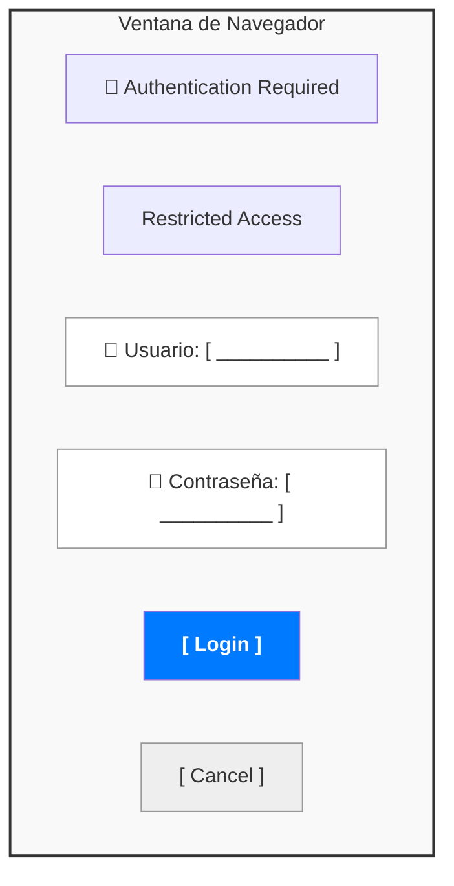
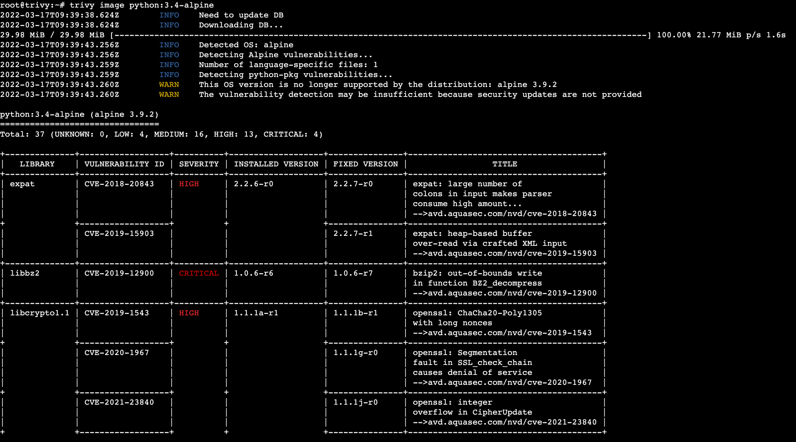

## MÓDULO 5: SEGURIDAD Y HTTPS

En los módulos anteriores hemos aprendido a servir contenido estático, a configurar Nginx como proxy inverso y a distribuir tráfico entre múltiples backends. Pero toda esa infraestructura es inútil si las comunicaciones no son seguras: sin cifrado, cualquier atacante en la red podría interceptar contraseñas, datos personales o tokens de sesión. Este módulo cubre las **medidas de seguridad esenciales** que todo servidor web en producción debe implementar: desde el cifrado TLS/SSL y la redirección HTTPS, hasta la autenticación, el control de acceso por IP, la protección contra ataques de volumen (rate limiting) y el escaneo de vulnerabilidades en las imágenes Docker.

---

### 5.1 Cifrado TLS/SSL

#### Definición Técnica

**TLS (Transport Layer Security)** es un protocolo criptográfico que proporciona:
1. **Cifrado**: Datos ilegibles para terceros
2. **Integridad**: Detección de manipulación
3. **Autenticación**: Verificación de identidad del servidor (y opcionalmente cliente)

#### Componentes de TLS

**1. Certificado (Certificate)**:
- Documento digital que vincula clave pública con identidad
- Emitido por CA (Certificate Authority)
- Contiene: nombre de dominio, clave pública, firma CA, fecha validez

**2. Clave Privada (Private Key)**:
- Secreta, nunca se comparte
- Usada para descifrar y firmar

**3. Clave Pública (Public Key)**:
- Incluida en certificado
- Usada por clientes para cifrar

#### Criptografía Asimétrica (Handshake)

```mermaid
sequenceDiagram
    participant C as Cliente
    participant S as Servidor
    
    Note over C: 1. Negociación
    C->>S: ClientHello (versión TLS, ciphers)
    S-->>C: ServerHello (cipher, certificado, clave pública)
    
    Note over C: 2. Intercambio de Claves
    C->>S: Key Exchange (Pre-Master Secret cifrado)
    Note over C, S: [Ambos derivan Session Key]
    
    Note over C: 3. Confirmación
    C->>S: Finished
    S-->>C: Finished
    
    Note over C, S: 4. Comunicación Segura
    C->>S: Encrypted Application Data
    S-->>C: Encrypted Application Data
```



#### Criptografía Simétrica (Datos)

Después del handshake, se usa criptografía simétrica (más rápida):
- AES-GCM, ChaCha20-Poly1305
- Misma clave para cifrar/descifrar (session key)

---

### 5.2 Puerto 443 y Configuración SSL Básica

Ya entendemos cómo funciona TLS a nivel teórico: handshake, claves, cifrado simétrico tras la negociación. Ahora veamos cómo **configurar todo esto en Nginx** para que nuestro servidor escuche en el puerto 443 y sirva contenido cifrado.

#### Configuración Mínima

```nginx
server {
    listen 443 ssl;                         # Puerto HTTPS
    server_name ejemplo.com;
    
    # Certificado y clave privada
    ssl_certificate /etc/nginx/certs/ejemplo.com.crt;
    ssl_certificate_key /etc/nginx/certs/ejemplo.com.key;
    
    # Configuración básica
    ssl_protocols TLSv1.2 TLSv1.3;
    ssl_prefer_server_ciphers on;
    
    root /var/www/html;
}
```


#### Obtener Certificados

**Opción 1: Let's Encrypt (Gratis)**:

```bash
# Con certbot
certbot certonly --nginx -d ejemplo.com -d www.ejemplo.com

# Certificados en:
# /etc/letsencrypt/live/ejemplo.com/fullchain.pem
# /etc/letsencrypt/live/ejemplo.com/privkey.pem
```

**Configuración con Let's Encrypt**:

```nginx
server {
    listen 443 ssl http2;
    server_name ejemplo.com;
    
    ssl_certificate /etc/letsencrypt/live/ejemplo.com/fullchain.pem;
    ssl_certificate_key /etc/letsencrypt/live/ejemplo.com/privkey.pem;
    
    # Recommended by Let's Encrypt
    ssl_session_cache shared:SSL:10m;
    ssl_session_timeout 10m;
}
```

**Renovación Automática**:

```bash
# Cron job
0 3 * * * certbot renew --nginx --quiet && nginx -s reload
```

**Opción 2: Certificado Self-Signed (Desarrollo)**:

```bash
openssl req -x509 -nodes -days 365 -newkey rsa:2048 \
  -keyout /etc/nginx/certs/selfsigned.key \
  -out /etc/nginx/certs/selfsigned.crt \
  -subj "/C=ES/ST=Madrid/L=Madrid/O=Dev/CN=localhost"
```


---

### 5.3 Redirección HTTP a HTTPS

Tenemos HTTPS funcionando en el puerto 443, pero ¿qué pasa si un usuario escribe `http://ejemplo.com` en su navegador? Accedería por el puerto 80, **sin cifrado**. Para evitarlo, necesitamos **redirigir automáticamente** todo el tráfico HTTP hacia HTTPS.

#### Método 1: Return 301

```nginx
# Server block para HTTP
server {
    listen 80;
    server_name ejemplo.com www.ejemplo.com;
    
    # Redirección permanente
    return 301 https://$server_name$request_uri;
}

# Server block para HTTPS
server {
    listen 443 ssl http2;
    server_name ejemplo.com www.ejemplo.com;
    
    ssl_certificate /etc/nginx/certs/cert.pem;
    ssl_certificate_key /etc/nginx/certs/key.pem;
    
    root /var/www/html;
}
```


#### Método 2: Rewrite (menos eficiente)

```nginx
server {
    listen 80;
    server_name ejemplo.com;
    
    rewrite ^ https://$server_name$request_uri? permanent;
}
```


#### Método 3: Condicional (para excepciones)

```nginx
server {
    listen 80;
    server_name ejemplo.com;
    
    # Permitir HTTP para health checks
    location /health {
        return 200 "OK\n";
    }
    
    # Todo lo demás a HTTPS
    location / {
        return 301 https://$server_name$request_uri;
    }
}
```


#### Redirección con Preservación de Args

```nginx
# $request_uri incluye query string
return 301 https://$server_name$request_uri;

# Ejemplo:
# http://ejemplo.com/search?q=nginx
#  ↓
# https://ejemplo.com/search?q=nginx
```


---

### 5.4 HSTS (HTTP Strict Transport Security)

La redirección HTTP → HTTPS soluciona el problema para las visitas normales, pero tiene un punto débil: **la primera petición siempre viaja por HTTP** antes de ser redirigida. Un atacante en la red (man-in-the-middle) podría interceptar justo esa primera conexión. HSTS resuelve esto indicando al navegador que **nunca más** intente conectarse por HTTP.

#### Definición Técnica

HSTS es un mecanismo de seguridad web que fuerza a navegadores a usar **solo HTTPS** para todas las futuras comunicaciones con un dominio.

**Header**:

```
Strict-Transport-Security: max-age=31536000; includeSubDomains; preload
```


#### Funcionamiento

```
Primera visita:
Cliente → http://ejemplo.com
         ↓ 301 redirect
         https://ejemplo.com
         ↓ Response con header HSTS
Cliente guarda: "ejemplo.com → solo HTTPS por 1 año"

Visitas posteriores:
Cliente → [intenta http://ejemplo.com]
         ↓ Navegador intercepta ANTES de enviar request
         https://ejemplo.com (automático, sin round-trip)
```


#### Configuración en Nginx

```nginx
server {
    listen 443 ssl http2;
    server_name ejemplo.com;
    
    ssl_certificate /etc/nginx/certs/cert.pem;
    ssl_certificate_key /etc/nginx/certs/key.pem;
    
    # HSTS Header
    add_header Strict-Transport-Security "max-age=31536000; includeSubDomains; preload" always;
    
    root /var/www/html;
}
```


#### Parámetros

**1. `max-age`** (obligatorio):

- Tiempo en segundos que el navegador debe recordar
- `31536000` = 1 año (recomendado mínimo)
- `63072000` = 2 años

**2. `includeSubDomains`** (opcional):

- Aplica HSTS a todos los subdominios
- Usar SOLO si todos los subdominios tienen HTTPS

**3. `preload`** (opcional):

- Incluir en HSTS Preload List (hardcoded en navegadores)
- Requiere: max-age ≥ 1 año, includeSubDomains, certificado válido


#### HSTS Preload List

**Registro en https://hstspreload.org**:

```text
Requisitos:
1. HTTPS funcional
2. Redirect HTTP → HTTPS
3. HSTS con max-age >= 31536000
4. includeSubDomains
5. preload directive
```

**Ventaja**: Protección desde primera visita (sin necesidad de visitar el sitio antes)

#### Riesgos de HSTS

⚠️ **Cuidado con `includeSubDomains`**:

```nginx
# Si activas esto:
add_header Strict-Transport-Security "max-age=31536000; includeSubDomains" always;

# Y luego un subdominio NO tiene HTTPS:
# http://dev.ejemplo.com → INACCESIBLE por 1 año
```

⚠️ **Desactivar HSTS** (si es necesario):

```nginx
# Enviar max-age=0
add_header Strict-Transport-Security "max-age=0" always;
# Navegadores olvidarán HSTS en próxima visita
```


#### Protección Contra Downgrade Attacks

**Sin HSTS**:

```
Atacante (MITM) → Intercepta http://ejemplo.com
                  → Mantiene conexión HTTP
                  → Roba credenciales
```

**Con HSTS**:

```
Navegador → Intenta http://ejemplo.com
           → HSTS activo: auto-upgrade a HTTPS
           → Atacante no puede downgrade
           → Falla si certificado inválido (no se permite override)
```


---

### 5.5 Autenticación Básica HTTP

Además del cifrado de las comunicaciones, a veces necesitamos **restringir quién puede acceder** a ciertas secciones de nuestro sitio web. La autenticación básica HTTP es el mecanismo más sencillo para proteger directorios con usuario y contraseña, ideal para paneles de administración o entornos de staging.

#### Definición

HTTP Basic Authentication: mecanismo simple de autenticación usuario/contraseña codificado en Base64 (NO cifrado, usar con HTTPS).

#### Crear Archivo de Usuarios

```bash
# Instalar htpasswd (Apache utils)
apt-get install apache2-utils  # Debian/Ubuntu
yum install httpd-tools         # RHEL/CentOS

# Crear usuario
htpasswd -c /etc/nginx/.htpasswd admin
# Solicita contraseña

# Añadir más usuarios (sin -c)
htpasswd /etc/nginx/.htpasswd user2
```

**Formato del archivo**:

```
admin:$apr1$5K8Y/.../hashed_password
user2:$apr1$aB3x/.../hashed_password
```


#### Configuración en Nginx

```nginx
server {
    listen 443 ssl;
    server_name ejemplo.com;
    
    ssl_certificate /etc/nginx/certs/cert.pem;
    ssl_certificate_key /etc/nginx/certs/key.pem;
    
    # Proteger todo el sitio
    auth_basic "Restricted Access";
    auth_basic_user_file /etc/nginx/.htpasswd;
    
    root /var/www/html;
}
```


#### Proteger Solo Directorios Específicos

```nginx
server {
    listen 443 ssl;
    server_name ejemplo.com;
    
    # Público
    location / {
        root /var/www/public;
    }
    
    # Protegido: Admin panel
    location /admin/ {
        auth_basic "Admin Area";
        auth_basic_user_file /etc/nginx/.htpasswd;
        
        root /var/www/admin;
    }
    
    # Protegido: API privada
    location /api/private/ {
        auth_basic "API Access";
        auth_basic_user_file /etc/nginx/.htpasswd_api;
        
        proxy_pass http://backend;
    }
}
```


#### Desactivar Auth para IPs Específicas

```nginx
location /admin/ {
    satisfy any;  # Satisfacer auth O allow (no ambos)
    
    allow 192.168.1.0/24;  # Red local sin auth
    deny all;
    
    auth_basic "Admin Area";
    auth_basic_user_file /etc/nginx/.htpasswd;
    
    root /var/www/admin;
}
```


#### Prompt de Login

Cuando el navegador encuentra `auth_basic`, muestra:




#### Limitaciones

1. **No es seguro sin HTTPS**: Credenciales en Base64 (fácil decodificar)
2. **No hay logout**: Navegador cachea credenciales hasta cerrar
3. **UX pobre**: Prompt nativo del navegador (no customizable)
4. **No es adecuado para producción pública**: Usar OAuth2, JWT, etc.

**Uso recomendado**:

- Admin panels internos
- Protección rápida de staging environments
- Restricción temporal de acceso

---

### 5.6 Ocultar Versión de Nginx

Otro aspecto fundamental de la seguridad es la **información que nuestro servidor revela sobre sí mismo**. Por defecto, Nginx incluye su número de versión en las respuestas HTTP, lo que facilita a un atacante buscar vulnerabilidades específicas para esa versión. Ocultarla es una medida sencilla pero importante.

#### Problema: Information Disclosure

Por defecto, Nginx expone su versión:

```bash
curl -I http://ejemplo.com

# Response:
HTTP/1.1 200 OK
Server: nginx/1.25.3  ← Versión expuesta
```

**Riesgo**: Atacantes saben qué vulnerabilidades explotar.

#### Directiva `server_tokens`

```nginx
http {
    # Ocultar versión
    server_tokens off;
    
    server {
        listen 80;
        server_name ejemplo.com;
        root /var/www/html;
    }
}
```

**Resultado**:

```bash
curl -I http://ejemplo.com

HTTP/1.1 200 OK
Server: nginx  ← Sin versión
```


#### Cambiar Completamente el Header Server

**Método 1: Recompilar con headers-more module**:

```nginx
http {
    more_set_headers "Server: MyCustomServer";
}
```

**Método 2: Usar imagen Docker custom**:

```dockerfile
FROM nginx:alpine

# Instalar nginx-module-headers-more
RUN apk add --no-cache nginx-mod-http-headers-more

# Configuración
COPY nginx.conf /etc/nginx/nginx.conf
```


#### Otras Protecciones de Security-by-Obscurity

```nginx
http {
    # Ocultar versión Nginx
    server_tokens off;
    
    # Header Server custom
    more_set_headers "Server: WebServer";
    
    # Remover headers que revelan backend
    proxy_hide_header X-Powered-By;
    proxy_hide_header X-AspNet-Version;
    proxy_hide_header X-AspNetMvc-Version;
    
    server {
        listen 443 ssl http2;
        server_name ejemplo.com;
        
        # Ocultar versión de PHP (si aplica)
        fastcgi_hide_header X-Powered-By;
        
        root /var/www/html;
    }
}
```


---

### 5.7 Control de Acceso por IP

Además de ocultar información, podemos **restringir el acceso según la dirección IP de origen**. Esto es especialmente útil para proteger paneles de administración (solo accesibles desde la red interna) o para bloquear IPs que han mostrado comportamiento malicioso.

#### Directivas `allow` y `deny`

**Sintaxis**:

```nginx
allow address | CIDR | all;
deny address | CIDR | all;
```

**Orden de evaluación**: Primera coincidencia gana.

#### Ejemplos Básicos

**Permitir solo red local**:

```nginx
location /admin/ {
    allow 192.168.1.0/24;  # Red local
    allow 10.0.0.0/8;      # Red VPN
    deny all;              # Todo lo demás
    
    root /var/www/admin;
}
```

**Bloquear IPs específicas**:

```nginx
location / {
    deny 203.0.113.45;     # IP maliciosa 1
    deny 198.51.100.0/24;  # Rango malicioso
    allow all;             # Resto permitido
    
    root /var/www/html;
}
```


#### Geo-blocking (con GeoIP module)

```nginx
# Requiere nginx-module-geoip
http {
    geoip_country /usr/share/GeoIP/GeoIP.dat;
    
    map $geoip_country_code $allowed_country {
        default no;
        ES yes;  # España
        FR yes;  # Francia
        DE yes;  # Alemania
    }
    
    server {
        listen 80;
        server_name ejemplo.com;
        
        if ($allowed_country = no) {
            return 403;
        }
        
        root /var/www/html;
    }
}
```


#### Combinación Allow + Auth

```nginx
location /admin/ {
    # Opción 1: Satisfacer AMBOS (default)
    satisfy all;
    
    allow 192.168.1.0/24;
    deny all;
    
    auth_basic "Admin";
    auth_basic_user_file /etc/nginx/.htpasswd;
    
    # Requiere: estar en red local Y autenticarse
}

location /api/ {
    # Opción 2: Satisfacer CUALQUIERA
    satisfy any;
    
    allow 10.0.0.0/8;  # Red interna sin auth
    deny all;
    
    auth_basic "API Access";
    auth_basic_user_file /etc/nginx/.htpasswd;
    
    # Permite: estar en red interna O autenticarse
}
```


---

### 5.8 Rate Limiting (Límite de Peticiones)

Más allá de bloquear IPs específicas, necesitamos protegernos contra **ataques de volumen**: un atacante (o un bot) que envía miles de peticiones por segundo para saturar nuestro servidor o adivinar contraseñas por fuerza bruta. El rate limiting permite establecer un **límite máximo de peticiones** por cliente.

#### Definición Técnica

**Rate limiting** controla el número de peticiones que un cliente puede hacer en un período de tiempo, protegiendo contra:

- Ataques de fuerza bruta (login, API)
- DDoS de capa 7 (application layer)
- Scraping abusivo
- Consumo excesivo de recursos


#### Directiva `limit_req_zone`

**Sintaxis**:

```nginx
limit_req_zone key zone=name:size rate=rate;
```

**Parámetros**:

- `key`: Variable para identificar cliente (ej: \$binary_remote_addr)
- `zone`: Nombre de zona de memoria compartida
- `size`: Tamaño de zona (1MB ≈ 16,000 IPs)
- `rate`: Tasa permitida (ej: 10r/s = 10 requests por segundo)


#### Configuración Básica

```nginx
http {
    # Definir zona de rate limiting (1 request/segundo por IP)
    limit_req_zone $binary_remote_addr zone=one:10m rate=1r/s;
    
    server {
        listen 80;
        server_name ejemplo.com;
        
        location / {
            # Aplicar rate limit
            limit_req zone=one;
            
            root /var/www/html;
        }
    }
}
```

**Comportamiento**:

```
IP 203.0.113.45:
Request 1 (t=0s)   → 200 OK
Request 2 (t=0.5s) → 503 Service Temporarily Unavailable (rechazado)
Request 3 (t=1.1s) → 200 OK
```


#### Burst (Ráfaga)

Permite ráfagas temporales por encima del rate.

```nginx
http {
    limit_req_zone $binary_remote_addr zone=one:10m rate=1r/s;
    
    server {
        location / {
            limit_req zone=one burst=5;
            # Permite burst de 5 requests, luego aplica rate
            
            root /var/www/html;
        }
    }
}
```

**Comportamiento con burst**:

```
Requests 1-6 (instantáneos) → Todos aceptados (burst=5 + 1 normal)
Request 7 (inmediato)      → 503 (burst agotado)
[Espera 1s]
Request 8                  → 200 OK (rate recuperado)
```


#### Burst con Delay (Two-Stage Rate Limiting)

```nginx
http {
    limit_req_zone $binary_remote_addr zone=one:10m rate=5r/s;
    
    server {
        location / {
            limit_req zone=one burst=12 delay=8;
            
            # Primeras 8 requests: sin delay
            # Requests 9-12: delayed (throttled a 5r/s)
            # Request 13+: 503
            
            root /var/www/html;
        }
    }
}
```

**Comportamiento**:

```
Requests 1-8:  Procesados inmediatamente (dentro de burst sin delay)
Requests 9-12: Throttled a 5r/s (delayed para cumplir rate)
Request 13+:   503 (burst completo agotado)
```


#### Rate Limiting por Location

```nginx
http {
    # Zona para login (más restrictivo)
    limit_req_zone $binary_remote_addr zone=login:10m rate=5r/m;  # 5 req/minuto
    
    # Zona para API (menos restrictivo)
    limit_req_zone $binary_remote_addr zone=api:10m rate=10r/s;
    
    server {
        listen 80;
        server_name ejemplo.com;
        
        # Login: 5 intentos por minuto
        location /login {
            limit_req zone=login burst=3;
            proxy_pass http://backend;
        }
        
        # API: 10 requests por segundo
        location /api/ {
            limit_req zone=api burst=20 delay=10;
            proxy_pass http://backend;
        }
        
        # Resto sin limit
        location / {
            root /var/www/html;
        }
    }
}
```


#### Rate Limiting por API Key

```nginx
http {
    # Key basada en header custom
    limit_req_zone $http_x_api_key zone=api_key:10m rate=100r/s;
    
    server {
        location /api/ {
            # Sin API key → reject
            if ($http_x_api_key = "") {
                return 401 '{"error": "API key required"}';
            }
            
            # Con API key → apply rate limit
            limit_req zone=api_key burst=200;
            
            proxy_pass http://backend;
        }
    }
}
```


#### Whitelisting (Exención de Rate Limit)

```nginx
http {
    # Geo para identificar red interna
    geo $limit {
        default 1;
        10.0.0.0/8 0;      # Red interna sin límite
        192.168.1.0/24 0;  # Red local sin límite
    }
    
    map $limit $limit_key {
        0 "";
        1 $binary_remote_addr;
    }
    
    limit_req_zone $limit_key zone=one:10m rate=10r/s;
    
    server {
        location / {
            limit_req zone=one burst=20;
            root /var/www/html;
        }
    }
}
```


#### Response al Rate Limit

**Default**: 503 Service Temporarily Unavailable

**Customizar**:

```nginx
http {
    limit_req_zone $binary_remote_addr zone=one:10m rate=10r/s;
    limit_req_status 429;  # Too Many Requests (más apropiado)
    
    server {
        location / {
            limit_req zone=one burst=20;
            
            root /var/www/html;
        }
        
        # Página custom para 429
        error_page 429 = @ratelimit;
        location @ratelimit {
            default_type application/json;
            return 429 '{"error": "Too many requests", "retry_after": "1s"}';
        }
    }
}
```


#### Logging de Rate Limit

```nginx
http {
    # O desactivar logging de rate limits
    limit_req_log_level info;
}
```

> [!TIP]
> **Pro Tip: WAF (Web Application Firewall)**
> El *Rate Limiting* protege contra el *volumen* de peticiones, pero no contra el *contenido* malicioso (SQL Injection, XSS). Para una protección completa, en entornos corporativos se suele combinar Nginx con un **WAF** como **ModSecurity** o **NixArmor**. Estos analizan el cuerpo de la petición y bloquean ataques específicos antes de que lleguen a tu aplicación.


---

---

### 5.9 CORS y Preflight Requests

#### El Problema del "Same-Origin Policy"
Por seguridad, los navegadores bloquean por defecto las peticiones AJAX/Fetch a un dominio diferente al de la página web.
- Si tu frontend está en `frontend.com` y pide datos a `api.backend.com`, el navegador **bloqueará** la respuesta.

#### Preflight Requests (OPTIONS)
Antes de hacer la petición real (GET, POST), el navegador envía una petición "previa" de tipo **OPTIONS** para preguntar al servidor: *"¿Me das permiso para acceder?"*.
- Si el servidor no responde 200 OK a este OPTIONS, la petición real nunca se envía.

#### Configuración CORS en Nginx
Para permitir CORS, debemos añadir encabezados específicos (`Access-Control-Allow-*`) y manejar el método OPTIONS.

```nginx
location /api/ {
    # 1. Permitir origen específico (NO usar '*' en producción con credenciales)
    add_header 'Access-Control-Allow-Origin' 'https://mi-frontend.com' always;
    
    # 2. Métodos permitidos
    add_header 'Access-Control-Allow-Methods' 'GET, POST, OPTIONS, DELETE, PUT' always;
    
    # 3. Headers permitidos (Content-Type, Auth, etc.)
    add_header 'Access-Control-Allow-Headers' 'DNT,User-Agent,X-Requested-With,If-Modified-Since,Cache-Control,Content-Type,Range,Authorization' always;
    
    # 4. Manejo del Preflight (OPTIONS)
    if ($request_method = 'OPTIONS') {
        # Responder 204 No Content (pero con los headers de arriba)
        add_header 'Access-Control-Allow-Origin' 'https://mi-frontend.com' always;
        add_header 'Access-Control-Allow-Methods' 'GET, POST, OPTIONS, DELETE, PUT' always;
        add_header 'Access-Control-Allow-Headers' 'DNT,User-Agent,X-Requested-With,If-Modified-Since,Cache-Control,Content-Type,Range,Authorization' always;
        
        # Cachear la respuesta preflight por 24h
        add_header 'Access-Control-Max-Age' 1728000;
        add_header 'Content-Type' 'text/plain; charset=utf-8';
        add_header 'Content-Length' 0;
        return 204;
    }
    
    proxy_pass http://backend;
}
```

---

### 5.10 Escaneo de Vulnerabilidades en Imágenes Docker

Hasta ahora hemos asegurado la **configuración de Nginx**: cifrado, redirección, autenticación, control de acceso e incluso limitación de peticiones. Pero la seguridad no termina ahí. La propia **imagen Docker** que contiene Nginx incluye un sistema operativo base y librerías que pueden tener vulnerabilidades conocidas. El último paso para asegurar nuestra infraestructura es **escanear esas imágenes** antes de desplegarlas en producción.

#### ¿Por qué escanear imágenes?

Cada imagen Docker contiene un sistema operativo base y paquetes que pueden tener **vulnerabilidades conocidas** (CVEs). Una imagen no escaneada puede desplegar software con fallos de seguridad críticos en producción sin que lo sepamos.

```
Imagen Docker
├── Alpine Linux 3.19 → ¿Tiene CVEs conocidos?
├── OpenSSL 3.1.4     → ¿Versión vulnerable?
├── nginx 1.25.3      → ¿Parche pendiente?
└── curl 8.5.0        → ¿Exploit público?
```


#### Trivy (Herramienta Principal)

**Trivy** es un escáner open-source de Aqua Security. Es el más adoptado por su facilidad y velocidad.

**Instalación**:

```bash
# Con Docker (sin instalar nada en el host)
docker run aquasec/trivy image nginx:alpine

# Instalación nativa en Alpine
apk add trivy

# Instalación en Ubuntu/Debian
sudo apt-get install trivy
```

**Escaneo básico**:

```bash
# Escanea la imagen nginx:alpine
trivy image nginx:alpine
```

**Ejemplo de output**:



**Niveles de severidad**:

| Severidad | Significado | Acción |
|:----------|:-----------|:-------|
| **CRITICAL** | Explotable remotamente, acceso total | ⛔ Corregir inmediatamente |
| **HIGH** | Explotable con condiciones | 🔴 Corregir antes de producción |
| **MEDIUM** | Requiere acceso local o condiciones complejas | 🟡 Planificar corrección |
| **LOW** | Impacto mínimo | 🟢 Evaluar en próxima actualización |

**Opciones útiles de Trivy**:

```bash
# Solo mostrar HIGH y CRITICAL
trivy image --severity HIGH,CRITICAL nginx:alpine

# Output en formato JSON (para automatización)
trivy image --format json --output report.json nginx:alpine

# Escanear un Dockerfile antes de construir
trivy config ./Dockerfile

# Ignorar vulnerabilidades sin fix disponible
trivy image --ignore-unfixed nginx:alpine

# Escanear imagen local (sin descargar de registry)
trivy image --input mi-imagen.tar
```


#### Docker Scout (Alternativa Oficial de Docker)

**Docker Scout** está integrado en Docker Desktop y Docker Hub.

```bash
# Resumen rápido de vulnerabilidades
docker scout quickview nginx:alpine

# Análisis detallado con recomendaciones
docker scout cves nginx:alpine

# Comparar dos versiones (¿mejoré la seguridad?)
docker scout compare nginx:1.24-alpine nginx:1.25-alpine
```

**Ventajas de Docker Scout**:
- Integrado en Docker Desktop (sin instalar nada extra)
- Muestra recomendaciones de actualización
- Comparación entre versiones de una misma imagen

**Comparación Trivy vs Docker Scout**:

| Característica | Trivy | Docker Scout |
|:--------------|:------|:-------------|
| **Licencia** | Open Source | Freemium |
| **Integración CI/CD** | Excelente | Buena |
| **Velocidad** | Muy rápido | Rápido |
| **Base de datos** | NVD + múltiples fuentes | Docker Hub + Sysdig |
| **Escaneo Dockerfile** | ✅ | ❌ |
| **Recomendaciones fix** | Básicas | Detalladas |


#### Integración en CI/CD

El escaneo debe ser **automático** en el pipeline de despliegue, no manual:

```yaml
# Ejemplo en GitHub Actions
name: Security Scan

on:
  push:
    branches: [main]

jobs:
  scan:
    runs-on: ubuntu-latest
    steps:
      - uses: actions/checkout@v4

      - name: Build image
        run: docker build -t mi-app:${{ github.sha }} .

      - name: Run Trivy scan
        uses: aquasecurity/trivy-action@master
        with:
          image-ref: mi-app:${{ github.sha }}
          severity: 'CRITICAL,HIGH'
          exit-code: '1'    # Falla el pipeline si encuentra CRITICAL/HIGH
```

**Flujo recomendado**:

```
Desarrollador → Push → Build imagen → Trivy scan → ¿Vulnerabilidades?
                                                      │
                                            NO → Deploy ✅
                                            SÍ → Bloquear + Notificar ❌
```


#### Buenas Prácticas para Reducir Vulnerabilidades

1. **Usar imágenes base mínimas**: `alpine` en vez de `debian/ubuntu`
2. **Actualizar regularmente**: `docker pull nginx:alpine` para obtener parches
3. **Pin de versiones**: `FROM nginx:1.25.3-alpine3.19` (versión exacta)
4. **Escaneo en cada build**: Nunca desplegar sin escanear
5. **No instalar paquetes innecesarios**: Cada paquete es superficie de ataque
6. **Usar multi-stage builds**: La imagen final solo tiene el runtime


#### Checklist de Seguridad Pre-Producción

```bash
# 1. Escanear vulnerabilidades
trivy image --severity HIGH,CRITICAL mi-app:latest

# 2. Verificar que no ejecuta como root
docker inspect --format='{{.Config.User}}' mi-app:latest

# 3. Verificar puertos expuestos
docker inspect --format='{{.Config.ExposedPorts}}' mi-app:latest

# 4. Verificar que no hay secretos en la imagen
docker history --no-trunc mi-app:latest | grep -i "password\|secret\|key"

# 5. Verificar tamaño (imágenes grandes = más superficie de ataque)
docker images mi-app:latest --format "{{.Size}}"
```


---

## Referencias

- [Nginx HTTPS Server Configuration](https://nginx.org/en/docs/http/configuring_https_servers.html)
- [Enable TLS 1.3 in Nginx](https://ma.ttias.be/enable-tls-1-3-nginx/)
- [HSTS and Nginx - Blog](https://blog.nginx.org/blog/http-strict-transport-security-hsts-and-nginx)
- [Nginx Rate Limiting Module](https://nginx.org/en/docs/http/ngx_http_limit_req_module.html)
- [Rate Limiting - Nginx Shield](https://www.cybrosys.com/blog/how-nginx-rate-limiting-shields-your-server-from-brute-force-attacks)
- [HSTS Preload List](https://hstspreload.org/)
- [Let's Encrypt](https://letsencrypt.org/)
- [Mozilla SSL Config Generator](https://ssl-config.mozilla.org/)

